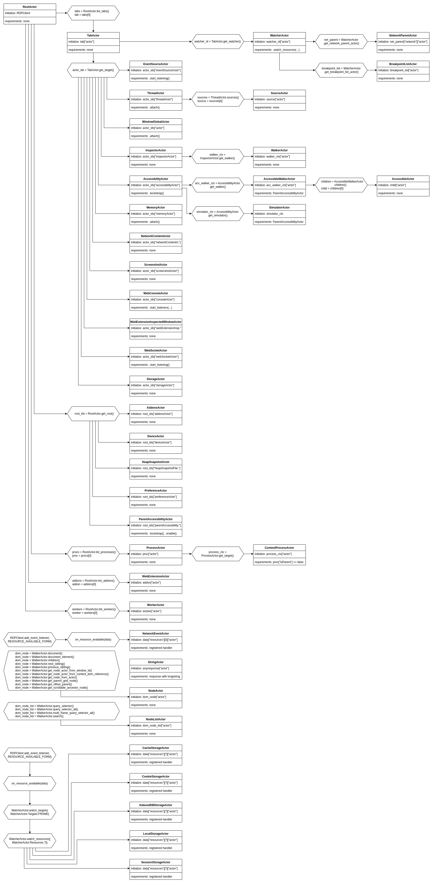

geckordp
=

This is a client implementation of Firefox DevTools over remote debug protocol in python.

It essentially exposes the raw api to interact with the debug server and has some similarities with a common webdriver. See also [Documentation](https://reapler.github.io/geckordp).

***What's possible with geckordp?***

Geckordp is meant to be used as a low level library to build tools on top.
With a few helpers like the WebExtension-API and a proxy server, it can be feature rich enough for:

+ web ui-testing
+ extension testing
+ browser test tools
+ webdriver
+ data scraping
+ https recording
+ network traffic analysis
+ remote controller for browser
+ ...and possibly more


## Getting Started
<!-- SEPARATOR -->

To use Geckordp, install it with:

```bash
pip install geckordp
# python -m pip install geckordp
# python -m pip install geckordp[develop]
```
Documentation can be generated with:
```
sphinx-build -a -c docs/src -b html docs/build docs
```

## Usage
<!-- SEPARATOR -->

```python
import json
from geckordp.rdp_client import RDPClient
from geckordp.actors.root import RootActor
from geckordp.profile import ProfileManager
from geckordp.firefox import Firefox


""" Uncomment to enable debug output
"""
#from geckordp.settings import GECKORDP
#GECKORDP.DEBUG = 1
#GECKORDP.DEBUG_REQUEST = 1
#GECKORDP.DEBUG_RESPONSE = 1


def main():
    # clone default profile to 'geckordp'
    pm = ProfileManager()
    profile_name = "geckordp"
    port = 6000
    pm.clone("default-release", profile_name)
    profile = pm.get_profile_by_name(profile_name)
    profile.set_required_configs()

    # start firefox with specified profile
    Firefox.start("https://example.com/",
                  port,
                  profile_name,
                  ["-headless"])

    # create client and connect to firefox
    client = RDPClient()
    client.connect("localhost", port)

    # initialize root
    root = RootActor(client)

    # get a list of tabs
    tabs = root.list_tabs()
    print(json.dumps(tabs, indent=2))

    input()

if __name__ == "__main__":
    main()
```
See also [examples](https://reapler.github.io/geckordp/examples/modules.html) and [tests](https://github.com/reapler/geckordp/tree/master/tests/actors).


## Tested Platforms
<!-- SEPARATOR -->

| Tested Platform                            | Working                 | Firefox-Version         |
| -------------------------------------------| ------------------------| ------------------------|
| Windows (x64)                              | yes                     |  91.0                   |
| Ubuntu 20.04                               | yes                     |  91.0                   |
| macOS 12                                   | [?](https://github.com/reapler/geckordp/issues/new)                       |  91.0                   |

Geckordp requires minimum Python 3.7 and the latest Firefox build. Older versions of Firefox may also work as long the API changes are not too drastically. In case of doubt, clone and run tests with:
```bash
cd <your-repositories-path>
git clone https://github.com/reapler/geckordp
cd geckordp
python -m pip uninstall geckordp
python -m pip install -e $PWD
pytest tests/ &> test.log
```


## Contribute
<!-- SEPARATOR -->

Every help in form of issues or pull requests are very appreciated. If you would like to improve the project there are a few things to keep in mind:

For submitted code:
* formatting
* tests required (if new)
* should basically reflect the geckodriver api (if possible)

For issues or improvements see [here](https://github.com/reapler/geckordp/issues/new).

For features, I suggest to just ask on the issue tracker.


## Develop
<!-- SEPARATOR -->

To get an idea what's missing, here is a rough list of some notable objectives:

* add remaining actors from geckodriver
* add documentation for *all* actors its functions (even official repository got none)

If you are willing to get your hands dirty, please follow me [here](https://github.com/reapler/geckordp/blob/master/dev/README.md).


## Technical Details
<!-- SEPARATOR -->

To be able to communicate with the server, a pre-configured profile is required.

Geckordp offers additional helper functions to resolve this problem with the [ProfileManager](https://reapler.github.io/geckordp/geckordp.profile.html#geckordp.profile.ProfileManager).

The following flags are changed on profile configuration:

    ### disable crash-recover after 'ungraceful' process termination
    ("browser.sessionstore.resume_from_crash", False)

    ### disable safe-mode after 'ungraceful' process termination
    ("browser.sessionstore.max_resumed_crashes", 0)
    ("toolkit.startup.max_resumed_crashes", -1)
    ("browser.sessionstore.restore_on_demand", False)
    ("browser.sessionstore.restore_tabs_lazily", False)

    ### set download folder (not set by firefox)
    ("browser.download.dir", str(Path.home()))

    ### enable compatibility
    ("devtools.chrome.enabled", True)

    ### don't open dialog to accept connections from client
    ("devtools.debugger.prompt-connection", False)

    ### enable remote debugging
    ("devtools.debugger.remote-enabled", True)

    ### allow tab isolation (for e.g. separate cookie-jar)
    ("privacy.userContext.enabled", True)

    ### misc
    ("devtools.cache.disabled", True)
    ("browser.aboutConfig.showWarning", False)
    ("browser.tabs.warnOnClose", False)
    ("browser.tabs.warnOnCloseOtherTabs", False)
    ("browser.shell.skipDefaultBrowserCheckOnFirstRun", True)
    ("pdfjs.firstRun", True)
    ("doh-rollout.doneFirstRun", True)
    ("browser.startup.firstrunSkipsHomepage", True)
    ("browser.tabs.warnOnOpen", False)
    ("browser.warnOnQuit", False)
    ("toolkit.telemetry.reportingpolicy.firstRun", False)
    ("trailhead.firstrun.didSeeAboutWelcome", True)

<!-- SEPARATOR -->
Once the new profile was created, Firefox can be started with it.
However, actors need to be initialized at first.

Some actors need to call additional functions to get initialized on server-side.
But this is not always necessary and depends on what is actually needed.
These required functions and its actors are initialized respectively used in this order according to the [pcap-dumps](https://github.com/reapler/geckordp/blob/master/dev).


| Browser initialization:

    RDPClient()                 -> .connect()
        v
    RootActor()                 -> .get_root()
        v
    DeviceActor()               -> .get_description()
        v
    ProcessActor()              -> .get_target()
        v
    WebConsoleActor()           -> .start_listeners([])
        v
    ContentProcessActor()       -> .list_workers()

| Tab initialization:

    TabActor()                  -> .get_target()*
        v
    BrowsingContextActor()      -> .attach()*
        v
    WebConsoleActor()           -> .start_listeners([])*
        v
    ThreadActor()               -> .attach()*
        v
    WatcherActor()              -> .watch_resources(...)*
        v
    TargetConfigurationActor()


\**required if this actor will be used or events are wanted*

<!-- SEPARATOR -->
The following hierarchy [diagram](https://reapler.github.io/geckordp/actors/modules.html) shows dependencies between the actors and how to initialize single actors: [](#diagram)



For debugging purposes, Geckordp can be configured to print out requests and responses to better understand the structure of the json packets.
To enable it use:

```python
from geckordp.settings import GECKORDP
GECKORDP.DEBUG = 1
GECKORDP.DEBUG_REQUEST = 1
GECKORDP.DEBUG_RESPONSE = 1
# environment variables can also be used for e.g.
# GECKORDP_DEBUG_RESPONSE=1
```

<!-- SEPARATOR -->

Other noteworthy general hints, issues or experiences:

* actor initialization (plus the related functions like attach, watch or listening) on blank new tabs may get detached after visiting a new url and must be reinitiated (can be avoided if the page got a html header & body)
* received messages are just plain python dictionaries and most of the time it has consistent fields which can be directly accessed
* failed requests will return 'None'
* actors can have multiple contexts, that means different actor IDs can have the same actor model (for e.g. WebConsoleActor for process or tab)
* called functions within manually registered **async** handlers on RDPClient can not call functions which emitting 'RDPClient.send_receive()' later in its execution path (instead use non-async handlers in this case)
* on a new Firefox update it can happen that a few events doesn't get caught by the RDPClient handler or requests getting a wrong response, unfortunately a few event/response packets doesn't follow the same pattern and events must be manually specified in Geckordp which can have the implied side effects


## License
<!-- SEPARATOR -->
```
MIT License

Copyright (c) 2021 reapler

Permission is hereby granted, free of charge, to any person obtaining
a copy of this software and associated documentation files (the
"Software"), to deal in the Software without restriction, including
without limitation the rights to use, copy, modify, merge, publish,
distribute, sublicense, and/or sell copies of the Software, and to
permit persons to whom the Software is furnished to do so, subject to
the following conditions:

The above copyright notice and this permission notice shall be
included in all copies or substantial portions of the Software.

THE SOFTWARE IS PROVIDED "AS IS", WITHOUT WARRANTY OF ANY KIND,
EXPRESS OR IMPLIED, INCLUDING BUT NOT LIMITED TO THE WARRANTIES OF
MERCHANTABILITY, FITNESS FOR A PARTICULAR PURPOSE AND
NONINFRINGEMENT. IN NO EVENT SHALL THE AUTHORS OR COPYRIGHT HOLDERS BE
LIABLE FOR ANY CLAIM, DAMAGES OR OTHER LIABILITY, WHETHER IN AN ACTION
OF CONTRACT, TORT OR OTHERWISE, ARISING FROM, OUT OF OR IN CONNECTION
WITH THE SOFTWARE OR THE USE OR OTHER DEALINGS IN THE SOFTWARE.
```

<!-- CLASS_INDEX -->
